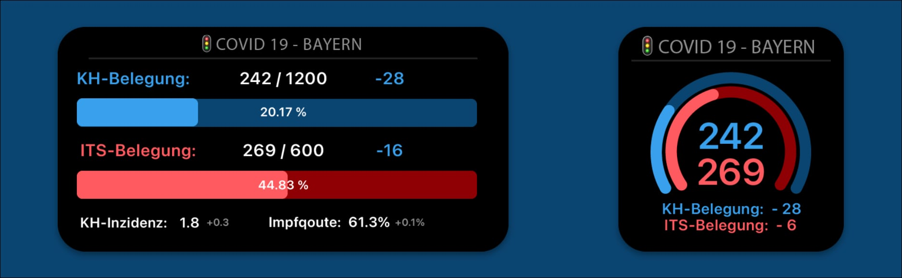

# iOS Covid-19 🚦Widget für Bayern

Kleines oder Mittelgroßes Widget für Scriptable das über die aktuelle Auslastung des Bayrischen Gesundheitsystems informiert.

## Voraussetzungen

* iOS 14
* Die neuste Version von [Scriptable für iOS](https://apps.apple.com/us/app/scriptable/id1405459188?ign-mpt=uo%3D4)

## Installation

Die Installation des Widgets ist einfach:

1. Öffne Scriptable und erstelle ein neues Widget. Optional: Wähle einen Titel und ein Icon für dein Widget.
2. Kopiere den Code aus 'kab.c19.widget.js' in dein Widget.
3. Unter dem Punkt: 'widgetConfig' -> 'size' kannst du die Größe des Widgets wählen.
4. Füge deinem Homescreen ein Scriptable Widget in der entsprechenden Größe hinzu (Klein oder Mittel).
5. Gehe auf 'Widget bearbeiten'.
6. Wähle dein kreirtes Widget als Script aus.
7. Verlasse den Bearbeitenmodus.

Auf deinem Homescreen sollte jetzt das Widget erscheinen.

## Konfiguration

Das Widget hat einige Parameter die du selbst bearbeiten kannst. Diese Parameter befinden sich am Anfang des WidgetCodes, unter den punkten 'widgetConfig' und 'canvasConfig'. Im nachfolgenden findest du eine kurze Aufstellung was die verschiedenen Parameter bewirken.

`widgetConfig.size`
Die Größe des Widgets. 'small' oder 'medium' sind die zugelassen Werte.  

`widgetConfig.colours` Passe die Farbgebung deines Widgets an. Farben sollten als HEX-Werte angegeben werden.

`widgetConfig.padding` Das Padding deines Widgets, also wie viel Platz zum Rand bleiben soll.

`widgetConfig.dev` Aktiviere den Developermodus mit erweiterten logs.

`canvasConfig.arcSpan` Die Kreisgröße des kleinen Widgets in Grad.

`canvasConfig.arcWidth` Die Strichgröße des Kreises des kleinen Widgets.

`canvasConfig.offsetY` Die vertikale Verschiebung des Widgets.

## Api

Das Widget benutzt die API der Webseite [krankenhausampelbayern.de](https://krankenhausampelbayern.de). Die Quelle der Daten ist das [lgl Bayern]('https://www.lgl.bayern.de/gesundheit/infektionsschutz/infektionskrankheiten_a_z/coronavirus/karte_coronavirus/index.htm').

## Licence

Das Widget ist OpenSource unter einer MIT Lizenz. Es steht dir frei den Code zu verwenden.
